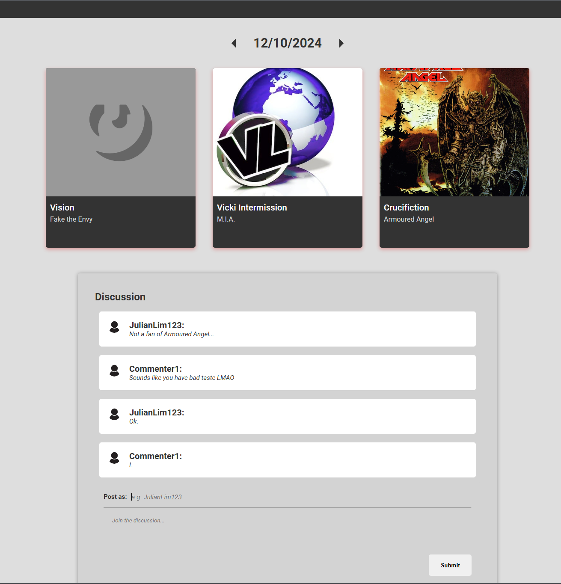

  

<h3 align="center">Random Songs Daily Discussion Board</h3>

---

## 🧠About 
Hi! Here's my finished technical assessment for the impact team. As required in the README submission instructions, I have provided a version of my web app that is runnable (has no database so no mongoDB password requirement) in the noDatabase folder. However, my finalised web app is in withDatabaseAndHistory and is the one I'm most proud of. The finalised version has a mongoDB database, and persistent comment and song storage, and the ability to view songs and comments from previous days, as my video will show. The runnable version refreshes comments and the 3 random songs on page reload, so it does not have persistent storage.

- [Link to Video of Running App](https://www.example.com)

## 🏁 Getting Started 
run npm install from frontend and backend folder
run npm run dev from frontend
run npm start from backend

## ⛏️ Built Using 

- [MongoDB](https://www.mongodb.com/) 
- [Express](https://expressjs.com/)
- [NodeJs](https://nodejs.org/en/)
- [ReactJs](https://react.dev/)
- [MaterialUI](https://mui.com/material-ui/)

## ✍️ Authors 

- [@julianl05](https://github.com/julianl05)

